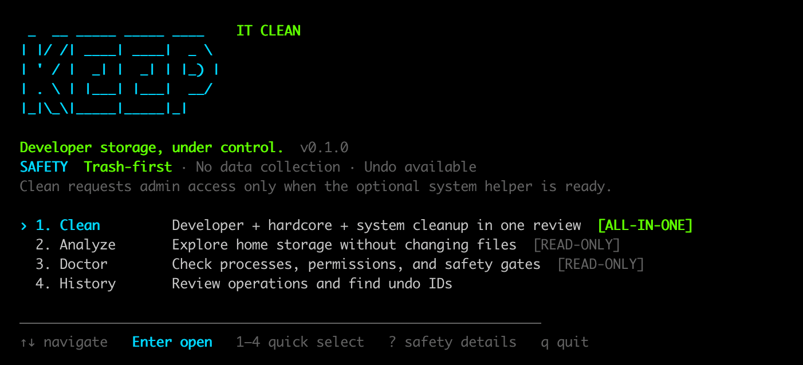

# KeepItClean



**KeepItClean** is a safety-first macOS developer storage cleaner. Its executable is `keep`.

It scans rebuildable caches and developer artifacts, explains risk and rebuild cost, creates an immutable cleanup plan, and moves reviewed files to Trash. The dashboard's single **Clean** flow combines normal, hardcore-retention, and optional system cleanup in one review. Developer data never needs `sudo`; allowlisted system cache/log leaves use a separately installed root-owned helper and protected quarantine. KeepItClean does not run a background agent, send telemetry, or treat an entire cache root as disposable.

> Status: v0.1.0 public preview. Validate with scan and dry-run before applying any cleanup.

## Why

Developer machines accumulate large but very different kinds of data: Gradle transforms, Kotlin/Native toolchains, LLDB modules, simulator state, container disks, dependency caches, AI-tool sessions, and locally published packages. KeepItClean distinguishes regenerable cache from toolchain, VM, credential, session, database, and user data before it offers an action.

The product is a GPL-3.0 Swift port derived from the safety ideas and history of [Mole](https://github.com/tw93/mole). Its compact storage-review experience also references public [CleanMyMac documentation](https://macpaw.com/support/cleanmymac/knowledgebase/my-tools). KeepItClean is independently named and is not affiliated with MacPaw.

## Requirements

- macOS 14 or newer
- Xcode 16 or a compatible Swift 6 toolchain
- Apple Silicon or Intel Mac

## Install with Homebrew

```bash
brew install minhnh510/tap/keepitclean
keep --version
keep
```

This fully qualified install trusts only the KeepItClean Formula from the
[official project tap](https://github.com/minhnh510/homebrew-tap). Normal and
hardcore developer cleanup stay user-scoped. Homebrew does not install the
optional privileged System Clean helper automatically; after reviewing it, run:

```bash
"$(brew --prefix keepitclean)/libexec/install-helper.sh"
```

## Build from source

```bash
swift build
swift test
swift build -c release
swift build -c release --arch arm64 --arch x86_64  # universal binary
```

Install for the current user without `sudo`:

```bash
make install
```

The installer targets `~/.local/bin` by default and refuses to replace an unrelated command named `keep`. Override the prefix with `PREFIX=/custom/prefix make install`.

The public preview also provides a universal `arm64` + `x86_64` archive and SHA-256 checksum on the [v0.1.0 release page](https://github.com/minhnh510/keepitclean/releases/tag/v0.1.0):

```bash
curl -LO https://github.com/minhnh510/keepitclean/releases/download/v0.1.0/keepitclean-v0.1.0-macos-universal.tar.gz
curl -LO https://github.com/minhnh510/keepitclean/releases/download/v0.1.0/keepitclean-v0.1.0-macos-universal.tar.gz.sha256
shasum -a 256 -c keepitclean-v0.1.0-macos-universal.tar.gz.sha256
tar -xzf keepitclean-v0.1.0-macos-universal.tar.gz
cd keepitclean-v0.1.0-macos-universal
./scripts/install-release.sh
```

Release binaries are ad-hoc signed and not Apple-notarized in v0.1.0. Verify the published checksum, or build from source if your Gatekeeper policy requires a notarized Developer ID artifact. The archive installer remains user-scoped and refuses to overwrite an unrelated `keep` command.

Optional System Clean support is installed separately and visibly:

```bash
make install-helper
keep system doctor
keep system scan       # read-only preview; macOS asks for admin access
```

Inside the downloaded release archive, run `./scripts/install-helper.sh` instead. This is the only archive installation step that invokes `/usr/bin/sudo`.

The installer places only `com.minhnh510.keepitclean.helper` in `/Library/PrivilegedHelperTools`, owned by `root:wheel` and not group/world-writable. The CLI always invokes the fixed root-owned `/usr/bin/sudo` and that exact helper with an argv array—never a shell command. `keep` itself continues running as your normal user.

## Commands

```text
keep [--hardcore]
keep scan [--root PATH] [--deep] [--hardcore] [--json]
keep analyze [PATH] [--deep] [--json]
keep clean [--hardcore] [--interactive]
keep clean [--plan FILE]
keep clean --plan FILE --interactive
keep clean --apply --trash --plan FILE
keep undo OPERATION_ID
keep finalize OPERATION_ID --confirm TOKEN
keep native-action list [--json]
keep native-action plan ACTION_ID [--json]
keep native-action run --plan FILE --confirm TOKEN [--json]
keep system scan
keep system apply PLAN_ID --confirm SYSTEM-CLEAN-XXXXXXXX
keep system undo OPERATION_ID
keep system finalize OPERATION_ID --confirm FINALIZE-SYSTEM-XXXXXXXX
keep system doctor
keep history
keep rules
keep doctor
keep completion SHELL
keep --version
```

`scan`, `analyze`, and `clean` without `--apply --trash` are read-only. The default scan is a fast top-level pass; `--deep` performs bounded recursive measurement for rule-backed candidates before review. `finalize` permanently removes only canonical Trash entries tied to both a reviewed private plan and one KeepItClean operation. Native-action `list` and `plan` provide an exact argv preview and per-action process policy, but production `run` fails closed in the v0.1 preview: Darwin has no public descriptor-bound `exec`, so launching a user-installed tool by pathname would reopen a TOCTOU window.

Running `keep` without arguments opens the branded dashboard instead of starting a scan immediately. Use arrow keys or `j`/`k`, press `Enter`, or press `1`–`4` to open Clean, Analyze, Doctor, or History. **Clean is all-in-one:** it scans normal and hardcore developer rules, includes allowlisted system candidates when the optional helper is ready, opens one combined immutable review, and uses one final `Enter`. If the helper is absent or its administrator prompt is cancelled, KeepItClean reports that system caches were skipped and continues the user-scoped cleanup without privilege. The home screen uses its own ANSI renderer and does not copy Mole artwork; review, confirmation, progress, alternate-screen restoration, and mutation safety boundaries remain KeepItClean-native.

`--hardcore` is an explicit aggressive retention profile and implies `--deep`. `keep --hardcore` is the short alias for `keep clean --hardcore --interactive`; use `keep scan --hardcore` / `keep clean --hardcore` for an unselected preview. Interactive cleanup automatically selects every exact candidate that passes the rule, ownership, activity, and protected-path gates; blocked or active items remain protected. It opens directly on the final confirmation: press `Enter` to move the verified set to Trash, `Esc` to inspect it, or `q` to cancel. For Gradle, it keeps every transform entry from the latest seven days and offers only individual older directories below `~/.gradle/caches/<version>/transforms*`; the transforms roots are never selected, and active/unknown Gradle state blocks the rule. It also keeps project-referenced Gradle, Android NDK, and Android `compileSdk` versions plus the newest installed fallback, then offers older version-scoped directories for Trash review. `.app`, `.so`, `.o`, and `.a` are grouped only inside build roots proven generated by tool markers; the newest exact project/filename member is retained. Additional high-risk review includes Codex day buckets older than seven days, timestamped `.codex.corrupt.*` snapshots older than 30 days, AVD snapshot roots, and exact user-scoped CoreSimulator `Images`/`dyld` caches. Recent Codex history, memories/SQLite/credentials/worktrees, AVD userdata/config, source, vendor/prebuilt binaries, and arbitrary matching extensions remain protected.

KeepItClean v0.1 verifies that Gradle is inactive but does not execute `gradle --stop` itself because production native execution is intentionally disabled. Stop Gradle daemons with the Gradle command approved by your project, then rescan. Large exact-entry sweeps are fully pre-journaled and checkpointed in batches, so an interrupted operation can be reconciled without an O(n²) history rewrite.

The system portion remains a separate privileged state machine under the combined UI. Its preview considers only root-owned regular-file leaves older than their retention window under `/Library/Caches`, `/Library/Logs/DiagnosticReports`, and `/private/var/log`. Software Update/MobileAsset stores, live logs, directories, symlinks, mount crossings, databases, and arbitrary `/Library` or `/private/var` content are never candidates. Apply re-scans the exact rule and identity, then uses fd-relative exclusive rename into `/var/db/KeepItClean/Quarantine`. This is undoable and does **not** reclaim free space yet. Permanent reclaim requires the separate `keep system finalize` command and its operation-specific typed token. User Trash and system quarantine deliberately keep separate operation IDs and journals, so either side can be recovered or undone independently; the combined confirmation is not presented as one atomic filesystem transaction.

The default TUI performs a normal + hardcore deep inventory, optionally obtains the helper's fixed-scope system inventory, and then opens one final confirmation with every eligible verified item already selected. Developer items move through the verified Trash gateway; system items move through the root-owned quarantine engine. Each engine saves its own fresh plan, shows progress or operation output, and prints its own undoable operation ID. Parameterized native action IDs are `colima.stop.<PROFILE>`, `android.avd-delete.<NAME>`, and `vscode.extension-uninstall.<PUBLISHER.NAME>`; use the corresponding read-only list/status action first.

“Read-only” means inspected files are never changed. `scan` and `analyze` do write a private, 30-minute plan under KeepItClean's Application Support directory so the later review/apply boundary is explicit.

## Safety model

1. Scan without mutation.
2. Build a short-lived versioned plan containing canonical path, device, inode, link count, owner, type, allocated/logical/reclaim estimates, modification time, and rule version. Stored plan IDs are create-only and are never overwritten.
3. Review every selected candidate and its exclusion siblings. TUI review derives a new immutable plan ID.
4. Re-run exact rule membership, identity, size, and active-state checks at the mutation boundary.
5. Journal deterministic destinations before mutation, then move with descriptor-relative, no-follow, exclusive rename and verify the resulting identity.
6. Reconcile an interrupted pre-journaled Trash move under the same lock, then undo with the fd-relative boundary or explicitly finalize through a separately journaled private quarantine.

The privileged system engine follows the same scan → short-lived plan → explicit final confirmation → fd-relative quarantine → verify sequence inside root-private state. The dashboard uses one final `Enter`; the direct `keep system apply` command remains available for scripting and requires the displayed plan token. It never receives an arbitrary root from the user and never executes `rm`, `find`, a shell, or a developer-tool binary.

KeepItClean fails closed for symlinks, traversal, protected roots, mount roots, identity/reclaim drift, and data whose ownership or rebuildability cannot be established. Filesystem candidates block on active or unknown owning-tool state when inactivity is required. Native-action policies are fully reviewable, but execution remains disabled until it can preserve the same descriptor-bound security boundary.

Protected examples include the Codex session root, its latest seven day buckets and every individual session file; Codex memories, SQLite databases, credentials and worktree state; Android AVD userdata/config; Colima disks and volumes; local Maven artifacts; private CocoaPods repositories; and arbitrary Downloads content. Only a complete old Codex `YYYY/MM/DD` bucket can cross the protected-root boundary, and only after the current hardcore rule and inactive-process state are revalidated.

See [SECURITY.md](SECURITY.md) and [docs/SECURITY_DESIGN.md](docs/SECURITY_DESIGN.md).

## Local data

- Short-lived plans: `~/Library/Application Support/KeepItClean/Plans`
- Bounded operation log: `~/Library/Logs/KeepItClean`
- Optional privileged plans, journal, and quarantine: `/var/db/KeepItClean`

KeepItClean has no persistent filesystem scan cache.

## License and upstream

GPL-3.0. See [LICENSE](LICENSE), [UPSTREAM.md](UPSTREAM.md), and [THIRD_PARTY_NOTICES.md](THIRD_PARTY_NOTICES.md).
